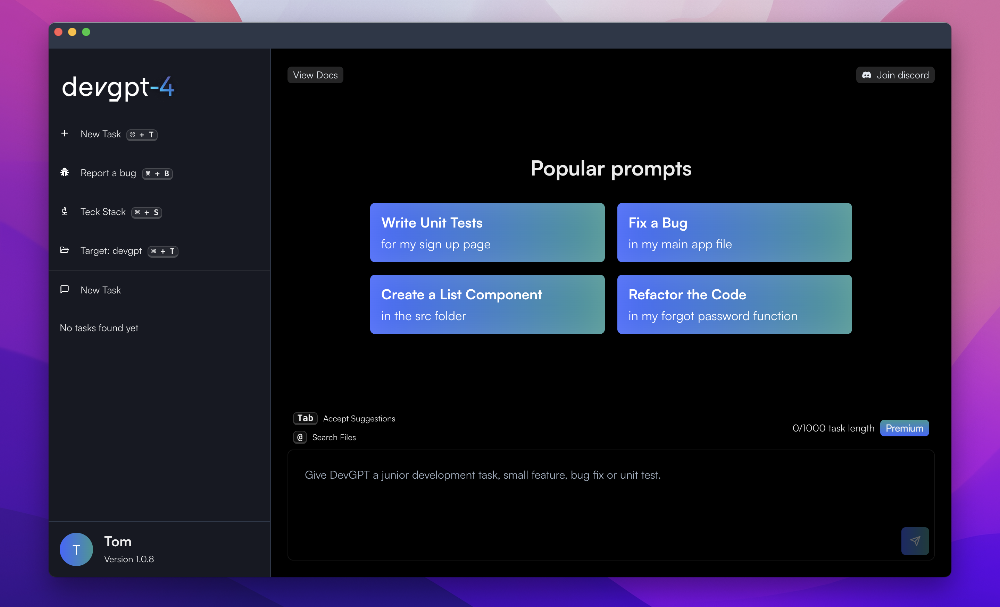

# DevGPT: We're building the world's best open-source dev agent.

## Table of Contents

1. [Introduction](#Introduction)
1. [Installation](#Installation)
1. [Features](#Features)
1. [How It Works](#How-It-Works)
1. [Key Outcomes](#Key-Outcomes)
1. [FAQs](#FAQs)
1. [Getting Started for Open-Source Contributors](#Getting-Started-for-Open-Source-Contributors)
1. [Support](#Support)

## Introduction

Welcome to **DevGPT**, the AI-driven development tool designed to transform the way you code. Created to assist developers in achieving their maximum potential, DevGPT is not just an auto-completion tool; it's your AI-powered dev-agent powered by gpt-4-32k and other models.

## Installation

Once you have the DevGPT release package, follow these straightforward installation steps:

1. **Run the correct installer for your operating system:** The installer will run and install DevGPT for you.

`MacOS: .dmg`

`Windows: .exe`

`Linux: .snap OR AppImage`

If you have any questions about installation, get in touch with our team via [Discord](https://discord.com/invite/6GFtwzuvtw)!

## Features

- **Code Generation**: Enter a prompt and get your required code generated.
- **One-Click Sync**: Directly sync generated code to your local code editor.
- **Personalized Training**: Our AI model trains on your code repository to generate code that perfectly fits into your codebase.
- **Follow-Up Prompts**: Need to modify generated code? Just enter follow-up prompts.

## How It Works

1. **Type Your Prompt**: Simply enter a prompt describing the code you need.
1. **Wait for Generation**: Our model takes an average of 40 seconds to generate your code.
1. **Sync to Local Editor**: With one click, sync the generated code to your local code editor.
1. **Optional Follow-Up Prompts**: If you wish to modify the generated code, you can enter follow-up prompts.

## Key Outcomes

- **Write Unit Tests**: Automatically generate unit tests for your codebase.
- **Write Complex Functions**: No need to fret over complex algorithms; let DevGPT handle them.
- **Create Components**: Create UI/UX components effortlessly.
- **Debug**: Troubleshoot issues in your code easily.

## FAQs

1. **Is this similar to Github Copilot?**
   - No, we are not an autocomplete tool. We handle entire tasks, acting as your co-developer.
1. **How much time will this save me?**
   - Our average user saves 1.5 hours every day, allowing you to focus on more complex and fulfilling tasks.

## Getting Started for Open-Source Contributors

1. Make sure you're using node v20.5.0, clone the project and npm install.
1. Create a new project on Supabase.com
1. Go to https://supabase.com/dashboard/project/{PROJECT_ID}/settings/api, copy the URL (it should be like: https://{PROJECT_ID}.supabase.co) and paste into "NEXT_PUBLIC_SUPABASE_URL" in your "renderer/EXAMPLE.env". Find the anon public key below and paste into "NEXT_PUBLIC_SUPABASE_ANON_KEY" in your "renderer/EXAMPLE.env". - Please rename this file to ".env".
1. Whilst in your new ".env" file, change the value of "NEXT_PUBLIC_OPENAI_API_KEY" to your OpenAI API key.
1. Go to https://supabase.com/dashboard/project/{PROJECT_ID}/sql/new and copy the SQL code from the file "supabase/SupabaseSetup.sql" into the text box and press RUN.
1. Run NPM install // Yarn install in the root directory of the project in your terminal.
1. Run NPM run dev // Yarn run dev in terminal.
1. Sign up to DevGPT in your local enviroment and see your account appear in your Supabase Table; you'll need to confirm your email address via email and this may require you to restart the app after confirmation.
1. Run the DevGPT-api repo (OSS on GitHub) to make prompts!

## Support

For any queries, issues, or support needs, feel free to contact us at support@devgpt.com

---

**Happy Coding!**

The DevGPT Team
